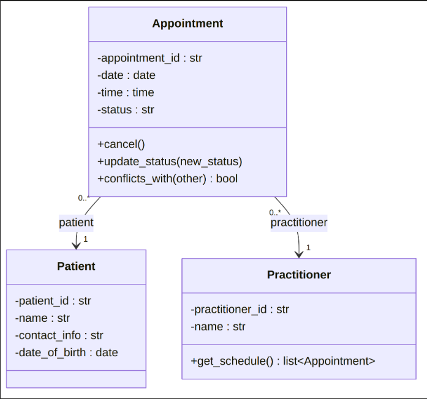

Part A 

"noun / candidate objet" 
(verb / candidate operation)
[business rule / constraint]

1. Stakeholder Analysis
"Reception staff": primary system users. (Book, view, update and cancel) "appointments"
"GPs": need to see their own "schedule" and their patients' "appointment history"
"Clinic manager": oversees clinic operations, needs visibility into "bookings, cancellations and no-shows"
"Patients": their data is (stored) and their "bookings" are (managed), though they are not direct users of the system
"System maintainer / future developer": [supports the system after handover, relevant to the client's stated requirement for a “maintainable” system]

2. Scope (in scope)
(Creating, viewing and searching) "patient records"
(Creating, viewing, updating and cancelling) "appointments"
basic "GP records"
[Preventing duplicate bookings]
"Appointment status" tracking [(Booked, Completed, Cancelled, No-show)]
"Appointment history" of "patients"
[Provisional: a daily operational report has not been explicitly confirmed as a requirement]

3. Functional requirements
FR-01: the system will allow a "receptionist" to (create) a new "patient record", storing "name, contact information and date of birth". [(Additional required fields to be confirmed with the client)]
FR-02: the system will allow a "receptionist" to (search) for an existing "patient record" by "name". [If the search field is left blank the system will reject the search and prompt the receptionist to enter a name]
FR-03: the system will allow a "receptionist" to (create) a new "appointment" by selecting a "patient, GP, date and time"
FR-04: [the system will not allow a new appointment to be saved if the selected GP already has an appointment at the same date and time]
FR-05: [the system will require patient name, GP name, appointment date and appointment time to be completed before an appointment can be saved]
FR-06: the system will allow "staff" to (view) all "scheduled appointments"
FR-07: the system will allow a "receptionist" to (update) an appointment's "status"
FR-08: the system will allow a "receptionist" to (cancel) an "appointment" when needed. [Whether cancelling automatically frees the appointment slot is an open question]
FR-09: the system will (retain) each "patient's appointment history"
FR-10: the system will allow a "receptionist" to (filter) "appointments" by "GP"
FR-11 (Provisional): the system will (restrict) a "GP's view" to their own "appointment schedule" only. [(placeholder added to cover an internal gap full authentication model to be confirmed with the client)]

4. Non-functional requirements
[NFR-01: appointment date and time will be stored as a structured date-time value, not free text, to support sorting and duplicate checks]
[NFR-02: all patient, GP and appointment data will remain persistent between sessions no data will be lost when the program is closed]
[NFR-03 (Provisional): a receptionist with minimal training should be able to book an appointment in under a target number of steps the exact figure is to be confirmed with the client]
[NFR-04: when a new feature is added to one functional area, no source files belonging to another functional area will be modified, as verified by reviewing the version-control diff for that change]
[NFR-05: each core function will be independently unit-testable]
Observation: the non-functional requirements are almost entirely business/quality rules rather than nouns or verbs — they constrain how the system must behave rather than naming domain objects or actions. This is expected, since NFRs describe qualities of the whole system rather than discrete concepts.

5. User stories and acceptance criteria
Sections 6 (Assumptions and Open Questions) and 7 (Selected AI Review Evidence) are not tagged below, as they are meta-analysis of the requirements above rather than source requirement text — they do not introduce new domain nouns, verbs or rules beyond what sections 1–5 already contain.
Story 1 — Booking an appointment
As a "receptionist", I want to (book) a new "appointment" so that a "patient" has a confirmed time with a "GP"
Given a patient and an available GP time slot, when the receptionist (submits) a booking with all required fields, the appointment is (saved) and appears in the "day's list"
[Failure: if the selected GP already has an appointment at that date/time, the system rejects the booking and shows a conflict message]
Story 2 — Searching for a patient
As a "receptionist", I want to (search) for a "patient" by "name" so I don't create a duplicate record
Given a patient record exists, searching by name (returns) "matching records"
[Failure: a blank search field is rejected, with a prompt to enter a name (same rule as FR-02, BR-9)]
Story 3 — Viewing a daily schedule
As a "GP", I want to (view) my "appointments" for the day so I can (prepare) for consultations
Given appointments exist for that date, they are shown in "time order"
[Failure: a request for an invalid calendar date is rejected with an error, rather than attempting to load and display bad data]
Story 4 — Cancelling an appointment
As a "receptionist", I want to (cancel) an "appointment" so the slot is freed and the record reflects the change
[Given a valid, existing appointment, cancelling sets its status to Cancelled and the slot becomes available again]
[Failure: cancelling a non-existent or already-cancelled appointment shows an error and makes no change]

BR-1: A GP cannot have two appointments at the same date and time (FR-04).

BR-2: Patient name, GP name, appointment date and appointment time are mandatory before an appointment can be saved (FR-05).

BR-3: Appointment date/time must be stored as structured data, not free text (NFR-01).

BR-4: All patient, GP and appointment data must persist between sessions (NFR-02).

BR-5: A GP's appointment view is restricted to their own schedule; the full authentication 
model is unconfirmed (FR-11).

BR-6: Appointment status must be one of Booked, Completed, Cancelled or No-show (Scope item 5).

BR-7: Additional patient fields beyond name, contact info and date of birth are unconfirmed with the client (FR-01).

BR-8: Daily reporting and SMS reminders are provisional, unconfirmed scope items (Scope item 7 and out-of-scope item 5).

BR-9: A blank patient-name search must be rejected with a prompt, rather than returning every record (FR-02).

BR-10: Whether cancelling an appointment automatically frees the slot, or is purely a status change, is an open question (FR-08).

BR-11: No source files belonging to one functional area may be modified when a feature is added to another; verified via version-control diff (NFR-04).

BR-12: Each core function must be independently unit-testable (NFR-05).

BR-13: A request for an invalid calendar date must be rejected with an error rather than processed (Story 3 failure scenario).

BR-14: Cancelling an appointment sets its status to Cancelled and frees the slot (Story 4 successful scenario) — this conflicts with FR-08, which leaves slot-freeing as an open question; the conflict is unresolved in v0.2 and should be raised with the client.

BR-15: Attempting to cancel a non-existent or already-cancelled appointment must show an error and make no change (Story 4 failure scenario)

B – Candidate Classes
Each candidate concept from Task A is evaluated against the confirmed requirements to decide whether it becomes a class in the domain model.

1. Patient
Supporting requirements: FR-01, FR-02, FR-09
Decision: Accepted
reason: Core domain entity with its own identity, data and history referenced across multiple FRs.
2. GP (GP)
Supporting requirements: FR-03, FR-04, FR-10, FR-11, Story 3
Decision: Accepted
reason: Core domain entity with distinct identity and behaviour (own schedule, conflict check).
3. Appointment
Supporting requirements: FR-03–FR-09, Story 1, 2, 4
Decision: Accepted
reason: Central transaction object linking one Patient and one GP owns status and conflict logic.
4. Receptionist
Supporting requirements: FR-01–FR-08, FR-10
Decision: Rejected (for now)
reason: An actor/role that operates the system, not a data-holding domain object no authentication model is confirmed yet (FR-11 note).
5. Clinic Manager
Supporting requirements: Stakeholder list only
Decision: Deferred
reason: No FR currently gives the manager any data or operation reporting is explicitly provisional.
6. Appointment Status
Supporting requirements: Scope item 5, FR-07
Decision: Attribute, not a class
reason: Has no independent identity or behaviour of its own modelled as an attribute/enumeration of Appointment.
7. Daily Report
Supporting requirements: Scope (provisional)
Decision: Rejected
reason: Explicitly unconfirmed with the client (BR-8).
8. SMS Reminder
Supporting requirements: Out of scope (provisional)
Decision: Rejected
reason: Explicitly out of scope.

C – CRC Cards

1. Patient
Responsibilities:
Store patient identifying and contact details (FR-01)
Support search by name (FR-02)
Maintain a link to appointment history (FR-09)
Collaborators:
Appointment

2. GP 
Responsibilities:
Store GP identifying details
Provide own schedule / appointment list (FR-10, FR-11, Story 3)
Participate in double-booking conflict check (FR-04)
Collaborators:
Appointment

3. Appointment
Responsibilities:
Store date, time and status, and link to one Patient and one GP (FR-03, FR-05)
Validate required fields before being saved (FR-05)
Detect conflicting bookings for the same GP/time (FR-04)
Change status when updated or cancelled (FR-07, FR-08)
Collaborators:
Patient
GP

D – UML Model 

E – AI Design Review

1. AI suggestion: Add a Patient class storing name, contact information and date of birth, with the ability to be located by name and to expose its appointment history.
Requirement ID(s) cited by AI: FR-01, FR-02, FR-09

2. AI suggestion: Add a GP class as a minimal record (name), used as a required selector in booking, the conflict check, and the GP filter.
Requirement ID(s) cited by AI: Scope item 3 (basic GP records), FR-03, FR-04, FR-10

3. AI suggestion: Add an Appointment class linking a patient, GP, and a structured (non-free-text) date-time, with mandatory fields before save, listing, status updates, cancellation, history retention, and GP-based filtering.
Requirement ID(s) cited by AI: FR-03, FR-04, FR-05, FR-06, FR-07, FR-08, FR-09, FR-10, NFR-01

4. AI suggestion: Add an AppointmentStatus enumeration with values Booked, Completed, Cancelled, No-show.
Requirement ID(s) cited by AI: Scope item 5 (status tracking), FR-07, FR-08

5. AI suggestion: Split business logic into per-area service classes (PatientService, AppointmentService, GPService) that depend on per-entity repository classes (PatientRepository, AppointmentRepository, GPRepository) for persistence, rather than putting logic directly on the entities.
Requirement ID(s) cited by AI: NFR-02 (persistence between sessions), NFR-04 (functional-area isolation), NFR-05 (independent unit-testability)

F – Compare and Decide

1. Patient class (name, contact info, DOB, searchable by name, exposes appointment history)
Classification: Accepted
Reasoning: Matches my Task B/C/D model closely — Patient was already accepted as a core domain class in Task B on FR-01, FR-02, FR-09, and its Task C CRC card already lists “support search by name” and “maintain a link to appointment history” as responsibilities. The AI's citations are accurate. One gap: my Task D skeleton hadn't yet exposed a method for appointment history, so a get_appointment_history() stub 
has been added to Patient (see updated Task D/G) to make this responsibility explicit in code, not just on the CRC card.

2. GP class (minimal record — name only, selector for booking, conflict check, GP filter)
Classification: Modified
Reasoning: The core concept matches my existing Practitioner class, and the citations (Scope item 3, FR-03, FR-04, FR-10) are correct. However, calling it a “minimal record” understates its role: my Task C CRC card also gives Practitioner the responsibility to “provide own schedule / appointment list” (FR-10, FR-11, Story 3), which the AI's suggestion omits — FR-11 and Story 3 aren't cited at all. We keep the get_schedule() stub already in my Task D/G model rather than reducing GP to a plain data record.

4. AppointmentStatus enumeration (Booked, Completed, Cancelled, No-show)
Classification: Rejected
Reasoning: A reasonable long-term improvement. It would let BR-6 be enforced by the type system rather than just documented,but it conflicts with my Task B decision that Appointment Status is “an attribute, not a class” at this stage, since it has no independent identity or behaviour of its own (Scope item 5, FR-07). Stage 3 explicitly asks for simple skeletons with no enforced business rules yet (Task G/H), so status stays a plain string attribute for now, the enum is noted as a worthwhile refinement for a later stage.

G – Python Class Skeletons
Skeletons only: attributes and method signatures matching Task D. Updated to add Patient.get_appointment_history() per the Accepted decision in Task F.

class Patient:
    def __init__(self, patient_id, name, contact_info, date_of_birth):
        self.patient_id = patient_id
        self.name = name
        self.contact_info = contact_info
        self.date_of_birth = date_of_birth
 
    def get_appointment_history(self):
        # TODO: return this patient's past appointments (FR-09)
        # Added per Task F - Accepted (AI suggestion 1)
        pass
 
 
class Practitioner:
    def __init__(self, practitioner_id, name):
        self.practitioner_id = practitioner_id
        self.name = name
 
    def get_schedule(self):
        # TODO: return this practitioner's appointments (FR-10, FR-11, Story 3)
        # Kept per Task F - Modified (AI suggestion 2 omitted this responsibility)
        pass
 
 
class Appointment:
    def __init__(self, appointment_id, date, time, patient, practitioner, status="booked"):
        self.appointment_id = appointment_id
        self.date = date
        self.time = time
        self.patient = patient
        self.practitioner = practitioner
        self.status = status
 
    def cancel(self):
        # TODO: set status to "Cancelled" (FR-08)
        pass
 
    def update_status(self, new_status):
        # TODO: validate and update status (FR-07)
        pass
 
    def conflicts_with(self, other_appointment):
        # TODO: check same practitioner + same date/time (FR-04)
        pass

H – Consistency Check
Comparing the Task D model against the Task G skeletons, including the decisions made in Task F:

1. Model element (Task D/F): Patient: patient_id, name, contact_info, date_of_birth get_appointment_history()
Code element (Task G): Patient.__init__ get_appointment_history() stub
Consistent? Yes
Note: New method added per Task F Accepted decision present as a stub only, no behaviour yet.

2. Model element 	(Task D/F): Practitioner: practitioner_id, name get_schedule()
Code element (Task G): Practitioner.__init__ get_schedule() stub
Consistent? Yes
Note: Kept per Task F Modified decision (AI's “minimal record” framing was rejected).

3. Model element (Task D/F): Appointment: id, date, time, status, patient, practitioner; cancel(), update_status(), conflicts_with()
Code element (Task G): Appointment.__init__ cancel(), update_status(), conflicts_with() stubs
Consistent? Yes
Note: All operations exist as stubs (pass) no business logic implemented yet, consistent with the instruction not to implement full behaviour in Stage 3.

4. Model element (Task D/F): BR-1 (no double booking)
Code element (Task G): conflicts_with() stub only
Consistent? Partially  flagged
Note: Model records the rule. code does not yet enforce it. Intentional gap for a later stage.

5. Model element (Task D/F): BR-2 (mandatory fields)
Code element (Task G): No validation in __init__
Consistent? Partially  flagged
Note: Same as above: validation deliberately deferred.

6. Model element (Task D/F): AppointmentStatus enum (Task F, AI suggestion 4)
Code element (Task G): Not present  status stays a plain str
Consistent? Yes
Note: Consistent with the Rejected decision in Task F matches the Task B decision that Appointment Status is an attribute, not a class.

7. Model element (Task D/F): Service/Repository classes (Task F, AI suggestion 5)
Code element (Task G): Not present
Consistent? Yes
Note: Consistent with the Rejected decision in Task F deliberately out of scope for Stage 3's simple skeletons.

Reflection

the hardest modelling choice was what to d with the appointmentstatus. the AI suggestion was to make it a formal listing, which is honestly not a bad choice, it would allow BR-7 to be enforced by the type of system instead of just documented. However, accepting it would have meant going back on the task B choice "an attribute, not a class". it was rejected for now.

the clearest case of AI over design was suggest 5, splitting the design into three service classes and three repositry classes before having any behaviour or presistence had been implemeneted. the NFR citiations were real, but stage 3 only asled for three simple entity skeletions. 

every accpeted or modified choice was checked agaisnt a specific requirement id rather than agaisnt how convincing the arguement sounded. For example, the GP suggestgion was modifed rather then accepted, because FR-11 and story 3 weere missing from the AI's own citation list even though the're apart of the GP responisbiliteies in Task C CRC card. That cross check agaisbt task A's bussiness rules and tasl C crc's card was the mian thing keeping the comparision evidence based rather than what sounded good.