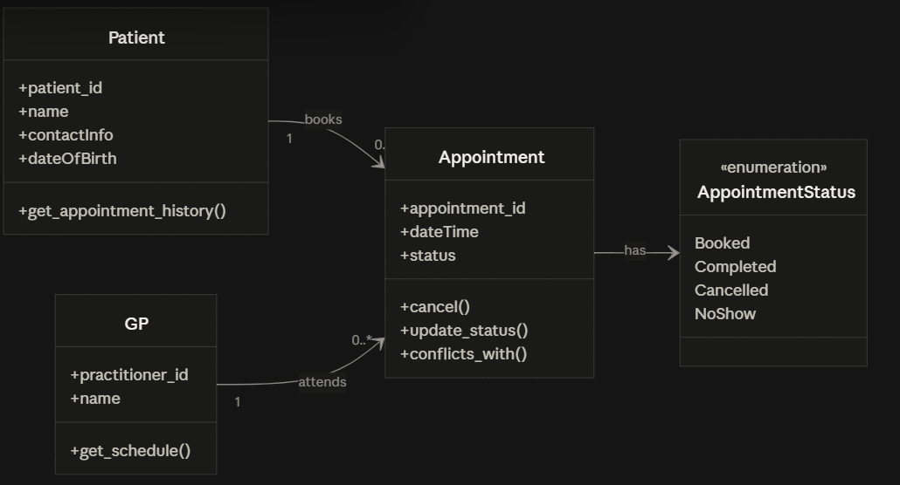

Requirement-to-Concept Trace
1. Requirement: FR-01
Concept: Patient
State/behaviour: State: patient_id, name, contact_info, date_of_birth
Decision: Accepted — core attribute set for the Patient class.

2. Requirement: FR-02
Concept: Patient
State/behaviour: Behaviour: searchable by name
Decision: Accepted — responsibility recorded on the Patient CRC card actual search logic deferred to a later stage.

3. Requirement: FR-03
Concept: Appointment
State/behaviour: State: links to one Patient and one Practitioner, date, time
Decision: Accepted — core relationship structure for Appointment.

4. Requirement: FR-04
Concept: Appointment
State/behaviour: Behaviour: conflicts_with(other) — reject double-booking
Decision: Accepted as a stub — rule recorded as BR-1 not yet enforced in code (flagged in Lab Task H).

5. Requirement: FR-05
Concept: Appointment
State/behaviour: Behaviour: mandatory-field validation before save
Decision: Accepted as a stub — rule recorded as BR-2 validation deferred to a later stage.

6. Requirement: FR-07 / FR-08
Concept: Appointment
State/behaviour: Behaviour: update_status(), cancel()
Decision: Accepted as stubs — the slot-freeing question on cancel() is unresolved (BR-10/BR-14) and flagged for the client.

7. Requirement: FR-09
Concept: Patient
State/behaviour: Behaviour: get_appointment_history()
Decision: Accepted — added following the AI Design Review (see AI Design Review Record below).

8. Requirement: FR-10 / FR-11
Concept: Practitioner
State/behaviour: Behaviour: get_schedule()
Decision: Accepted — kept on Practitioner despite an AI suggestion that would have dropped it (see AI Design Review Record).

9. Requirement: Scope item 5 / FR-07
Concept: AppointmentStatus
State/behaviour: State: one of Booked, Completed, Cancelled, No-show
Decision: Accepted as an optional class — elevated from a plain string attribute in the Lab (see Optional class CRC card and Design Rationale).

10. Requirement: NFR-01
Concept: Appointment
State/behaviour: State: date/time stored as structured values, not free text
Decision: Accepted as a data-type constraint on Appointment's own attributes, not a new class.

CRC Cards
1: Patient
Responsibilities:
Store patient identifying and contact details (FR-01)
Support search by name (FR-02)
Expose its own appointment history via get_appointment_history() (FR-09)
Collaborators:
Appointment

2: Practitioner
Responsibilities:
Store GP identifying details
Provide own schedule / appointment list via get_schedule() (FR-10, FR-11)
Participate in double-booking conflict check (FR-04)
Collaborators:
Appointment

3: Appointment
Responsibilities:
Store date, time and status, and link to one Patient and one Practitioner (FR-03, FR-05)
Validate required fields before being saved (FR-05)
Detect conflicting bookings for the same GP/time (FR-04)
Change status when updated or cancelled (FR-07, FR-08)
Collaborators:
Patient
Practitioner
AppointmentStatus

uml diagram 

design rationale 

Class selection: Patient, Practitioner and Appointment each have their own identity, data and behaviour grounded in FR-01–FR-11, so all three were accepted. Receptionist, Clinic and Database were rejected for lacking that independent identity and behaviour.

Responsibility allocation: conflicts_with() sits on Appointment, since conflict is a property of the appointment itself. get_schedule() sits on Practitioner, since it's the practitioner asking about their own appointments. Each class only owns its own state and instance-level behaviour  not collection-wide queries

AppointmentStatus as an optional class: previously a plain string, with an AI suggestion to make it an enum Rejected in the Lab. This workbook's Optional class slot is the natural place to make that change. it lets BR-6 be enforced by the type system at minimal cost, unlike the Servic, Repository suggestion, which stays rejected as genuine over-design.

Key relationships: Patient Appointment, Practitioner Appointment and Appointment AppointmentStatus are all associations, not inheritance none of these classes is a specialised kind of another, each simply references the other.

ai design review record 

1. Add a Patient class storing name, contact information and date of birth, with the ability to be located by name and to expose its appointment history.
Evidence: FR-01, FR-02, FR-09
Decision: Accepted
Reason: Matches the existing Patient class and its CRC responsibilities exactly. citations are accurate.
Model change: None, already reflected by get_appointment_history() on Patient.

2. Add a GP class, since GPs are selected when booking, are the basis of the double booking check, can be used to filter the appointment list, and can restrict a view to only their own schedule. Given that Open Question #2 leaves it unresolved whether GPs need full create/view functionality of their own, keep this class minimal for now rather than building out CRUD behaviour for it.
Evidence: FR-03, FR-04, FR-10, FR-11
Decision: Accepted
Reason: Unlike the Lab's original AI suggestion, this version explicitly covers the FR-11 own schedule responsibility that was missing before, and correctly leaves GP CRUD unresolved rather than assuming either way — matches the existing Practitioner CRC card in full.
Model change: None, already reflected by get_schedule() on Practitioner, with no CRUD operations added.

3. Add an Appointment class linking a patient and a GP, holding a structured date time value and a status, and enforcing that a booking can't be saved without a patient, GP, date and time, or if it would clash with another appointment for the same GP at the same time.
Evidence: FR-03, FR-04, FR-05, NFR-01
Decision: Modified
Reason: The linking, mandatory field and conflict check logic all match the existing Appointment class. However, “a structured date time value” suggests one combined field, where the model keeps date and time as two separate structured fields. both satisfy NFR-01, but splitting them makes it easier to query appointments by date alone.
Model change: None, kept existing separate date/time attributes rather than merging into one dateTime field.

4. Give Appointment the ability to have its status updated and to be cancelled, and make sure every patient's appointments remain retrievable as a history even after they're completed or cancelled.
Evidence: FR-06, FR-07, FR-08, FR-09
Decision: Accepted
Reason: Matches update_status() and cancel() on Appointment and get_appointment_history() on Patient exactly. Note: the FR-06 citation is a little loose — FR-06 is about staff viewing all scheduled appointments generally, not specifically about one patient's history — but the underlying design point is sound.
Model change: None, already satisfied by existing operations. no method signatures need to change.

5. Add an AppointmentStatus value that an Appointment holds, rather than treating status as free text.
Evidence: Scope item 5, FR-07
Decision: Accepted. updated from “Rejected” in the Stage 3 Lab.
Reason: Enforces BR-6 via the type system for minimal cost. this workbook's Optional class slot is the appropriate place to make the refinement already flagged as worthwhile in the Lab's Reflection.
Model change: Added, AppointmentStatus as a 4th class. Appointment.status changes from str to AppointmentStatus.