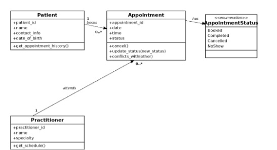

UML to code

1. UML element: Patient: -patient_id:str, -name:str, -contact_info:str, -date_of_birth:date
Python element: Patient.__init__ (patient.py)
Yes
Matches the approved UML exactly, each field validated as non-blank / correct type in __init__.

2. UML element: Patient, (no operation shown in approved UML)
Python element: Patient.get_appointment_history()
Yes (addition)
Not drawn in the attached diagram, added per the Stage 3 Task F 'Accepted' decision so FR-09 has something real to return. See Section 5.

3. UML element: Practitioner: 
practitioner_id: str, -name:str
Python element: Practitioner.__init__ (practitioner.py)
Yes
Matches the approved UML.

4. Practitioner: (no specialty attribute in approved UML)
Python element: Practitioner.specialty
Yes (addition)
Not in the attached diagram, added because Stage 4 Task C explicitly asks for it. See Section 5.

5. UML element: Practitioner: +get_schedule():list<Appointment>
Python element: Practitioner.get_schedule() -> list
Yes
Return type hint simplified to list rather than list<Appointment>, behaviour matches.

6. UML element Appointment: -appointment_id:str, -date:date, -time:time
Python element: Appointment.__init__ / self.appointment_id, self.date, self.time
Yes
Matches the approved UML exactly, appointment_id validated non-blank (BR-2).

7. UML element: Appointment: -status:str
Python element: Appointment._status : AppointmentStatus (via status property)
Yes (type changed)
Approved UML had status as a plain str, implemented as an AppointmentStatus enum instead, per this week's brief. See Section 5.

8. UML element: Appointment: +cancel()
Python element: Appointment.cancel()
Yes
Calls update_status(CANCELLED), the object is kept, never deleted (BR-15).

9. UML element Appointment: +update_status(new_status)
Python element: Appointment.update_status(new_status)
Yes
Enforces the BOOKED -> {COMPLETED, CANCELLED, NO_SHOW} rule (BR-6, BR-15).

10. UML element: Appointment: +conflicts_with(other):bool
Python element: Appointment.conflicts_with(other) -> bool
Yes
Matches exactly, a cancelled appointment never conflicts (BR-1).

11. UML element (not shown as its own class in week 6 UML)
APython element: ppointmentStatus (Enum)
Yes (new supporting type)
Added to satisfy this week's requirement for a status enum. See Section 5.

12. UML element (not shown in week 6 UML)
Python element: InvalidStatusTransitionError (Exception)
Yes (new supporting type)
Raised by update_status() on a disallowed transition, per the 'protect status transitions' instruction in the Stage 4 prompt.

13. UML element: Association, Appointment 0..* -> Patient 1 (role 'patient')
Python element: Appointment.patient attribute (set in __init__)
Yes
Plain reference, matches the diagram's association (see Section 3).

14. UML element: Association, Appointment 0..* -> Practitioner 1 (role 'practitioner')
Python element: Appointment.practitioner attribute (set in __init__)
Yes
Plain reference, matches the diagram's association (see Section 3).

Domain Invariants

1. 
Class: Patient

Invariant / rule: patient_id, name and contact_info must be provided (non-blank)

How protected: Patient.__init__ raises ValueError if any is blank.

2. 
Class: Patient

Invariant / rule: date_of_birth must be a real date, not free text (NFR-01 style rule applied to Patient too)

How protected: Patient.__init__ raises TypeError if date_of_birth is not a datetime.date.

3. 
Class: Practitioner

Invariant / rule: practitioner_id, name and specialty must be provided (non-blank)

How protected: Practitioner.__init__ raises ValueError if any is blank.

4. 
Class: Appointment

Invariant / rule: appointment_id must be provided (BR-2)

How protected: Appointment.__init__ raises ValueError if appointment_id is blank.

5. 
Class: Appointment

Invariant / rule: status must be one of BOOKED, COMPLETED, CANCELLED or NO_SHOW (BR-6)

How protected: status is typed as AppointmentStatus, a closed Enum, so no other value can exist.

6. 
Class: Appointment

Invariant / rule: BOOKED may move to COMPLETED/CANCELLED/NO_SHOW, no status may move anywhere once final (BR-6, BR-15), a GP cannot hold two active appointments at the same date/time (BR-1)

How protected: update_status() checks the _ALLOWED_NEXT table and raises InvalidStatusTransitionError otherwise, conflicts_with() lets a caller check BR-1 before booking (the caller is responsible for calling it).

Compoistion / Inhertiance Decisions

Relationship: Appointment -> Patient
Decision: Plain association (attribute reference), not composition or aggregation
Rationale: A Patient exists independently of any Appointment and can outlive it - a cancelled appointment is kept, not deleted (BR-15) - so Appointment must not own/destroy Patient. Matches the diagram's plain (non-diamond) arrow.

Relationship: Appointment -> Practitioner
Decision: Plain association, not composition
Rationale: Same reasoning as Patient: a Practitioner exists independently of any single Appointment.

Relationship: Patient/Practitioner -> Appointment (history/schedule list)
Decision: Unidirectional list held by Patient/Practitioner, aggregation, not composition
Rationale: Needed so get_appointment_history()/get_schedule() (FR-09/FR-10) have something real to return, without a repository/service class (Stage 3 Task F already rejected that pattern). Patient/Practitioner don't control the Appointment's lifecycle.

Relationship: Patient, Practitioner, Appointment - inheritance
Decision: No inheritance used anywhere, three independent, unrelated classes
Rationale: None of the three share enough common attributes/behaviour to justify a shared base class, matching the diagram (no generalisation arrows). Adding one would be the same kind of unrequested structure Stage 3 (Task F) already rejected for service/repository classes.

Relationship: AppointmentStatus / InvalidStatusTransitionError
Decision: Modelled as a Python Enum and an Exception subclass, not as ordinary associated classes
Rationale: AppointmentStatus is a fixed, closed set of values (BR-6), which Enum fits naturally, InvalidStatusTransitionError needs to work with normal try/except handling, so it must subclass Exception.

Ai Pair Programming 

AI contribution
Model consistency: AppointmentStatus enum, InvalidStatusTransitionError, and Appointment's three methods against the approved attributes and has relationship to AppointmentStatus
Conforms: Yes
Decision: Kept
Reason: Matches the approved model directly - the UML already links Appointment to an AppointmentStatus enumeration, so implementing status as that enum is compliance, not a deviation..
Verification: Task F checks 1, 3 and 4.

AI contribution
Unsupported features: every attribute - not just status - was wrapped in a @property with a private backing field
Conforms: No
Decision: Modified - reverted date/time/patient/practitioner to plain attributes, kept the property only on status
Reason:The approved UML shows every attribute as public (+), only status needs controlled mutation, per the Stage 4 prompt's 'protect status transitions' instruction, so wrapping the rest added unrequested structure.
Verification: Code review (Part G), behaviour confirmed: unchanged via Task F.

AI contribution
Public state mutation: status is only ever changed through update_status()/cancel(), never assigned directly
Conforms: Yes
Decision: Kept
Reason: The approved UML shows status as public, but BR-6/BR-15 still require controlled transitions, so guarding status specifically matches both the diagram and the business rules. 
Verification: Task F check 4 (re-cancelling raises an error instead of silently changing status).

AI contribution
Unnecessary inheritance: no base class or inheritance was introduced, Appointment stands alone
Conforms: Yes
Decision: Kept
Reason: Nothing in the approved design calls for a shared base class, and none was invented.
Verification: Code review (nothing to run).

AI contribution
Invented dependencies: no service, repository, UI, persistence or notification classes were added
Conforms: Yes
Decision: Kept
Reason: Matches the prompt's explicit instruction not to add database, UI, notification or service classes.
Verification: Code review (nothing to run).

AI contribution
Error handling: isinstance() checks on every constructor argument, plus InvalidStatusTransitionError for disallowed transitions
Conforms: Partially
Decision: Kept the exception, removed the isinstance() checks other than the appointment_id blank-check
Reason: The exception is genuinely needed (BR-6/BR-15), the type-checks went beyond what any requirement asks for.
Verification :Task F check 2 (blank-field rejections still work) and check 4 (exception still raised correctly).

updated uml

there was two differences from the week 6 UML comapred to the new one. There also two things that looked like differences but are not: AppointmentStatus is already shown to be linked to Appointment via a 'has' relationship. Patients get_appointment_history() is already shown on the approved Patient box. implementing both is compliance with the approved design, not a change to it.

1. Appointment models treat date and time as distinct attributes, while the accepted UML combines them into a single dateTime attribute. This represents a true structural distinction requiring a choice: either the diagram is interpreted as a shorthand for 'the appointment's date and time' (fulfilled by two fields), or the code needs to be modified to contain a single unified value. For now, it remains as two fields since the business rules don't require their combination, but this discrepancy between the code and diagram is worth mentioning if questioned.

2. Practitioner acquired a specialization: str characteristic. It does not appear on the authorized GP box (which only displays practitioner_id and name), it was included because Stage 4 Task C specifically necessitates it. No other Practitioner actions were altered.An additional supporting type without a corresponding diagram was included: InvalidStatusTransitionError, triggered by update_status() during an unauthorized transition. This is not a domain concept, and class diagrams typically do not represent exceptions, so it isn't shown as a box in the diagram below.No modifications were applied to Patient's attributes or its get_appointment_history() method, to Appointment's appointment_id/status or its relation to AppointmentStatus, to the association multiplicities, or to Practitioner's get_schedule() method. all of these already conformed to the authorized UML.

uml image 
